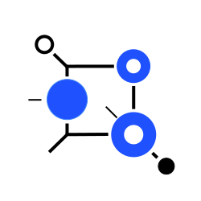

<div style="text-align: center;">
  
  <h1 style="margin-top: 12px;">Yukta</h1>
</div>

**Yukta** is a **high-performance workflow orchestrator** that executes dynamic DAG-based workflows with enterprise-grade control and observability.

[](LICENSE)
[](https://www.oracle.com/java/)
[](https://spring.io/projects/spring-boot)
[](https://gradle.org/)
[](https://modelcontextprotocol.io/)
[](https://www.graalvm.org/)

Yukta orchestrates **AI agent workflows**, **CI/CD pipelines**, **quality gates**, and **custom business workflows** using **Enterprise Integration Patterns** (EIPs). It provides:
- **DAG-based orchestration** with full control over workflow topology and execution semantics
- **Plugin ecosystem** for extensibility (Gradle, Maven, custom tools, AI models)
- **MCP integration** for native AI agent collaboration
- **Session-aware observability** with structured, traceable logs
- **Reactive, non-blocking architecture** for high-concurrency workloads

**Common use cases**:
- 🤖 **AI Agent Workflows**: Claude Code validates code changes in real-time with instant feedback loops
- 🔄 **CI/CD Orchestration**: Replace brittle shell scripts with type-safe, observable workflow definitions
- ✓ **Quality Gates**: Enforce code standards (formatting, linting, testing) with granular control
- ⚙️ **Custom Workflows**: Build domain-specific automation (data pipelines, compliance checks, deployment orchestration) without low-code limitations

---

## 🎯 Why Yukta?

| Use Case | Challenge | Yukta Solution |
|----------|-----------|---|
| **AI Agent Workflows** | AI-generated code breaks CI/CD; slow feedback loops | Real-time validation via MCP; instant feedback to AI agents for self-correction |
| **CI/CD Orchestration** | Shell scripts are fragile, hard to test, lack observability | Type-safe DAG workflows with reactive execution and structured logging |
| **Quality Gates** | Tool-specific integrations (Gradle, Maven, NPM) scattered across the stack | Unified plugin architecture; configure once, reuse everywhere |
| **Custom Workflows** | Low-code platforms lack fine-grained control; high-code requires reinventing orchestration | Enterprise Integration Patterns with developer control; reactive streams; extensible plugins |

---

## 🚀 Key Features

- **DAG-Based Orchestration**: Define complex workflows as Directed Acyclic Graphs with fine-grained control over topology, execution semantics, and resource management.
- **Enterprise Integration Patterns**: Built-in support for EIP concepts (routers, aggregators, transformers) for composable, reusable workflow components.
- **Extensible Plugin Architecture**: Trigger, Processor, and Terminal plugins enable integration with any tool (Gradle, Maven, custom scripts, AI models, external services).
- **MCP Native**: Model Context Protocol integration allows AI agents to orchestrate and monitor workflows in real-time.
- **Reactive & High-Performance**: Powered by Spring Boot WebFlux and Project Reactor for non-blocking, concurrent workflow execution (<100ms feedback loops).
- **Session-Aware Observability**: JSONL-formatted logs with context propagation across workflow executions—built for traceability and debugging.
- **GraalVM Native Image**: Compile to native executable (~50MB) for instant startup and minimal resource footprint in containerized environments.

---

## 📋 Prerequisites

- **Java 25+** (Java 25 recommended; Gradle handles toolchain)
- **Gradle 9.0+** (included: `./gradlew` works out-of-the-box)
- **Linux/macOS/Windows** (fully tested; production-ready on all platforms)
- **Optional**: AI agent client (Claude Code, or any ACP-compatible agent) for AI workflow integration

---

## 🚀 Quick Start

### 1. Clone & Start the Server

```bash
git clone https://github.com/infenia/yukta.git
cd yukta
./gradlew bootRun
```

The server starts on `http://localhost:8080` and exposes:
- **REST API**: `http://localhost:8080/api/`
- **Swagger UI**: `http://localhost:8080/swagger-ui.html`
- **MCP Server**: Native MCP integration for AI agents

### 2. Run Your First Quality Check (curl)

Initialize a session for your project:

```bash
curl -X POST http://localhost:8080/api/config \
  -H "Content-Type: application/json" \
  -d '{
    "sessionId": "my-session",
    "projectPath": "/path/to/your/project",
    "pluginName": "gradle",
    "pluginConfig": { "gradlePath": "./gradlew" },
    "tasks": ["spotlessCheck", "checkstyleMain"],
    "workflows": []
  }'
```

Log a file modification:

```bash
curl -X POST http://localhost:8080/api/files \
  -H "Content-Type: application/json" \
  -d '{
    "sessionId": "my-session",
    "path": "src/main/java/com/example/App.java"
  }'
```

Trigger quality checks:

```bash
curl -X POST http://localhost:8080/api/workflow/trigger \
  -H "Content-Type: application/json" \
  -d '{ "sessionId": "my-session" }'
```

**Expected output**:
```json
{
  "sessionId": "my-session",
  "status": "SUCCESS",
  "results": [
    {
      "taskName": "spotlessCheck",
      "status": "SUCCESS",
      "output": "All files are formatted correctly."
    },
    {
      "taskName": "checkstyleMain",
      "status": "SUCCESS",
      "output": "No Checkstyle violations found."
    }
  ]
}
```

### 3. Integrate with Claude Code (Optional)

To use Yukta with Claude Code, see **[Integration with Claude Code](docs/getting-started.md#2-integrating-with-claude-code)** in the Getting Started guide.

---

## 📚 Documentation

- **[Getting Started](docs/getting-started.md)** — Run your first check in 5 minutes; integrate with Claude Code.
- **[Architecture & Design](docs/architecture.md)** — How Yukta works: DAG workflows, plugin system, reactive streams.
- **[API Reference](docs/api-reference.md)** — Full endpoint documentation and request/response schemas.
- **[Plugin Development](docs/plugin-development.md)** — Extend Yukta with custom plugins for your build system.
- **[Development Setup](docs/development-setup.md)** — Set up your dev environment; run tests and quality gates.

---

## 💡 Usage Examples

### Example 1: Quality Gate Workflow (Linear Chain)

Run formatting, linting, and tests in sequence:

```bash
curl -X POST http://localhost:8080/api/config \
  -H "Content-Type: application/json" \
  -d '{
    "sessionId": "quality-checks",
    "projectPath": "/home/user/my-project",
    "pluginName": "gradle",
    "pluginConfig": { "gradlePath": "./gradlew" },
    "tasks": ["spotlessCheck", "checkstyleMain", "test"],
    "workflows": []
  }'

curl -X POST http://localhost:8080/api/workflow/trigger \
  -H "Content-Type: application/json" \
  -d '{ "sessionId": "quality-checks" }'
```

### Example 2: Complex DAG Workflow

Define a workflow with conditional branching: lint→test, then run coverage *only if* tests pass:

```bash
curl -X POST http://localhost:8080/api/config \
  -H "Content-Type: application/json" \
  -d '{
    "sessionId": "ci-pipeline",
    "projectPath": "/home/user/my-project",
    "pluginName": "gradle",
    "pluginConfig": { "gradlePath": "./gradlew" },
    "tasks": [],
    "workflows": [
      {
        "name": "ci-pipeline",
        "nodes": [
          { "id": "format", "pluginName": "gradle", "task": "spotlessCheck" },
          { "id": "lint", "pluginName": "gradle", "task": "checkstyleMain" },
          { "id": "test", "pluginName": "gradle", "task": "test" },
          { "id": "coverage", "pluginName": "gradle", "task": "jacocoTestReport" }
        ],
        "edges": [
          { "from": "format", "to": "lint" },
          { "from": "lint", "to": "test" },
          { "from": "test", "to": "coverage" }
        ]
      }
    ]
  }'
```

### Example 3: AI Agent Integration (Claude Code)

Real-time feedback for AI-generated code via MCP:

```bash
# 1. Initialize session
curl -X POST http://localhost:8080/api/config \
  -H "Content-Type: application/json" \
  -d '{
    "sessionId": "claude-session-123",
    "projectPath": "/home/user/my-project",
    "pluginName": "gradle",
    "pluginConfig": { "gradlePath": "./gradlew" },
    "tasks": ["spotlessCheck", "checkstyleMain"],
    "workflows": []
  }'

# 2. AI agent modifies a file (Claude Code triggers via hook)
# File logged automatically via session hook

# 3. Claude Code requests validation (via MCP)
curl -X POST http://localhost:8080/api/workflow/trigger \
  -H "Content-Type: application/json" \
  -d '{ "sessionId": "claude-session-123" }'

# Response includes exact errors → Claude Code auto-fixes and retries
```

---

## 📊 Known Limitations & Roadmap

| Feature | Status | Notes |
|---------|--------|-------|
| **Gradle Plugin** | ✅ Stable | Full support for Gradle 9.0+ |
| **Maven Plugin** | 📅 Planned (v0.2) | In progress; will support Maven 3.8+ |
| **NPM/Node Plugin** | 📅 Planned (v0.3) | Requested by community |
| **Custom Validators** | 🔄 Beta | Works but API may change |
| **Multi-Project DAGs** | ✅ Stable | Tested with 10+ node workflows |
| **Native Image (GraalVM)** | ✅ Stable | ~50MB executable; see `docs/native-image.md` |
| **Real-time Feedback Loop** | ✅ Stable | <100ms latency for MCP calls |
| **Windows Support** | ✅ Stable | Full support (tested on Windows 11) |
| **Docker Support** | 📅 Planned (v0.2) | Dockerfile will be provided |
| **Cloud Deployment** | 📅 Planned (v0.3) | Kubernetes & AWS Lambda guides |

**What we *won't* do**:
- Force specific code styles (plugins are optional)
- Run untrusted code (sandboxed execution in v0.2)
- Store code in the cloud (all processing is local-first)

---

## 🛠️ Tech Stack

- **Java 25** (LTS alternative Java 21; Gradle handles toolchain)
- **Spring Boot 4.0.2** (WebFlux, Actuator, Spring AI)
- **Gradle 9.0** (multi-module with convention plugins)
- **GraalVM** (native image support; 50MB executable)
- **OpenAPI 3.0** (Swagger UI for API exploration)
- **Project Reactor** (Mono/Flux for reactive streams)

---

## 🤝 Contributing

We welcome contributions! Whether it's code, docs, bug reports, or ideas, we'd love to hear from you.

- **[Contributing Guide](CONTRIBUTING.md)** — Issues, PRs, and coding standards.
- **[Code of Conduct](CODE_OF_CONDUCT.md)** — Our community values.
- **[Good First Issues](https://github.com/infenia/yukta/labels/good%20first%20issue)** — Start here if you're new.

---

## 🛡️ Security

Found a security vulnerability? Please see our **[Security Policy](SECURITY.md)** for responsible disclosure.

---

## 📄 License

This project is licensed under the **Apache License 2.0** — see the [LICENSE](LICENSE) file for details.

**Why Apache 2.0?**
- Permissive: You can use, modify, and distribute Yukta freely (even in commercial projects).
- Patent protection: Includes explicit patent grants.
- Industry standard: Used by Spring, Gradle, Kubernetes, and thousands of open-source projects.

---

## 🙏 Acknowledgments & Call-to-Action

Yukta is developed and maintained by **[Infenia Private Limited](https://infenia.com)**.

- **Creator**: Arun Cherthedath Somanathan ([arun@infenia.com](mailto:arun@infenia.com))
- **Community**: Thanks to every contributor who has improved Yukta.

### ⭐ If Yukta helps you, **[star the repo ❤️](https://github.com/infenia/yukta)** and consider:

- **Sharing** your experience (Twitter, Reddit, DEV.to, Hacker News)
- **Contributing** (issues, PRs, plugin development, documentation)
- **Sponsoring** (buy me a coffee — link in repo sidebar)
- **Reporting bugs** (use GitHub Issues with reproduction steps)

---

## 📞 Questions?

- **GitHub Issues**: [Ask a question](https://github.com/infenia/yukta/issues/new?labels=question)
- **Discussions**: [Yukta Community](https://github.com/infenia/yukta/discussions)
- **Email**: arun@infenia.com

---

## 🎵 Fun Fact

*Yukta* (युक्त) is a Sanskrit word meaning **"united" or "joined"**—reflecting the philosophy of orchestrating disparate tools, systems, and agents into a cohesive, harmonious workflow. 🔗

---

Happy orchestrating! 🚀
