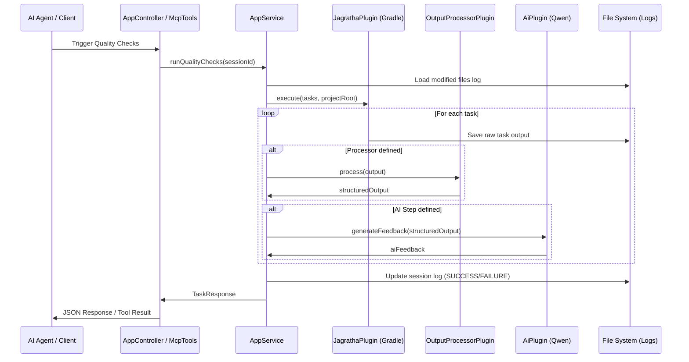
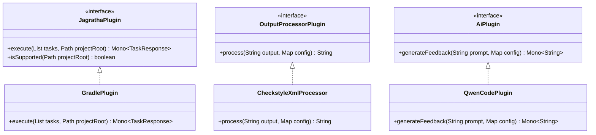

# Architecture & Design

This document provides a detailed overview of Jagratha's architecture, internal mechanisms, and design patterns.

## High-Level Overview

Jagratha is a vigilance server designed to enforce code quality gates for AI-driven development. It acts as an orchestrator between AI agents (via MCP or REST), build tools (like Gradle), and AI models (for feedback).

## Core Components

- **AppController**: REST API entry point for file logging, task execution, and configuration.
- **AppMcpTools**: Model Context Protocol (MCP) interface, allowing AI agents to interact with Jagratha directly via standard AI tool calling.
- **AppService**: The central orchestrator that manages sessions, triggers quality checks, and handles configuration.
- **JagrathaPlugin**: Abstraction for build tools (e.g., `GradlePlugin`).
- **OutputProcessorPlugin**: Processes raw task output into structured formats (e.g., `CheckstyleXmlProcessor` converts XML to JSONL).
- **AiPlugin**: Invokes AI models to provide feedback on quality check results (e.g., `QwenCodePlugin`).

## Sequence Diagram: Quality Check Execution

The following diagram illustrates the flow when a quality check is triggered (via `/api/tasks/complete` or MCP).



## Plugin System (Class Diagram)

Jagratha uses a plugin-based architecture to remain extensible and build-tool agnostic.



## Internal File Logging Mechanism

Jagratha maintains detailed logs for every session to track file modifications and task results.

### 1. Modified Files Log
Located at: `{fileLogDir}/{sessionId}/{sessionId.log}`
Format: **JSONL (JSON Lines)**

Each line represents a file modification event:
```json
{"path": "src/main/java/App.java", "status": "PENDING", "timestamp": "2026-01-01T10:00:00"}
```
- `PENDING`: File has been modified but not yet cleared by a successful quality check.
- `SUCCESS`: File has passed the most recent quality check.

### 2. Task Results
Located at: `{resultLogDir}/{sessionId}/`

- **Individual Task Logs**: `<submodule>-<task>-<datetime>.log`
  Contains the raw stdout/stderr of the executed task.
- **Summary Log**: `summary.log`
  A high-level summary of all tasks executed in the session.

### 3. Concurrency Handling
Jagratha uses session-specific `ReentrantLock` instances stored in a `ConcurrentHashMap` to ensure that logs for different sessions can be written concurrently without interference, while protecting individual session logs from race conditions.

## Tech Stack

- **Framework**: Spring Boot 4.0.2 (WebFlux)
- **Language**: Java 25 (with Java 21 toolchain)
- **Build Tool**: Gradle 9.0
- **AI Integration**: Spring AI (MCP Server)
- **Documentation**: Springdoc OpenAPI (Swagger)
- **Quality Gates**: Spotless, Checkstyle, PMD, SpotBugs, JaCoCo
