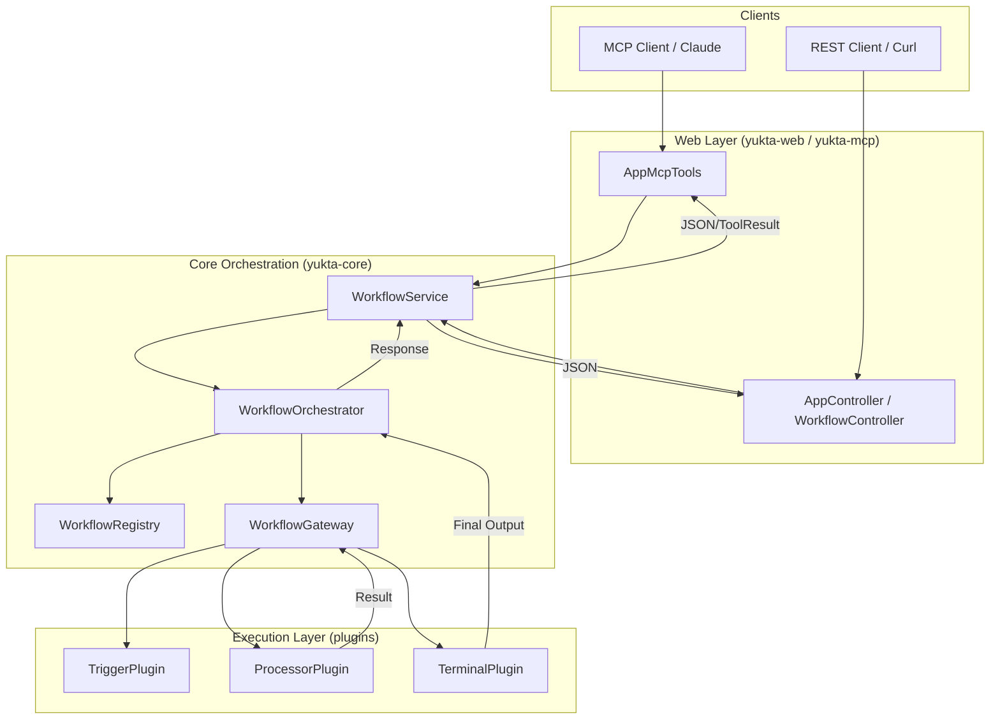
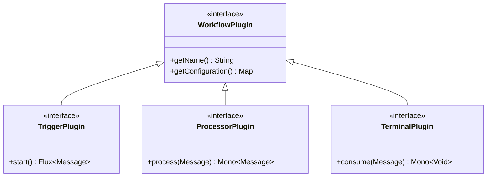

# Architecture & Design

This document provides a detailed overview of Yukta's architecture, internal mechanisms, and design patterns.

## 🌉 High-Level Overview

Yukta is a vigilance server designed to enforce code quality gates for AI-driven development. It acts as an orchestrator between AI agents (via MCP or REST), build tools (like Gradle), and AI models (for feedback).

## 🔄 Data Flow

The following diagram illustrates how a request (e.g., a workflow trigger) travels through the system.



---

## 🧵 Threading Model

Yukta utilizes a hybrid threading model to maximize throughput while handling both high-latency I/O and blocking process execution.

### 1. Reactive Core (WebFlux / Reactor)
The primary flow of the application is built on **Project Reactor**. All internal communication, event handling, and state management are non-blocking. This allows the server to handle thousands of concurrent sessions with a very small number of fixed platform threads.

### 2. Virtual Threads (Project Loom)
For operations that are inherently blocking—specifically executing external build tool processes (e.g., `./gradlew test`)—Yukta uses **Virtual Threads**.

- **VirtualThreadScheduler**: A custom Reactor `Scheduler` backed by an executor that spawns virtual threads.
- **Isolation**: Blocking tasks are offloaded to this scheduler, ensuring that the reactive "Event Loop" threads are never blocked.
- **Performance**: Since virtual threads are lightweight, we can start a new thread for every external process execution without worrying about thread-exhaustion.

```java
// Example of how Yukta bridges Reactive and Virtual Threads
public Mono<TaskResponse> runTask(Task task) {
    return Mono.fromCallable(() -> {
        // This runs in a Virtual Thread
        return processExecutor.execute(task.getCommand());
    }).subscribeOn(virtualThreadScheduler);
}
```

---

## 📦 Domain Model

The core domain of Yukta is built around the following entities:

- **Session**: Represents a unique interaction context (e.g., a single PR or a Claude Code session). It holds configuration, logs, and current state.
- **Workflow**: A Directed Acyclic Graph (DAG) of nodes that define the quality gate logic.
- **Message**: The unit of data that flows through a workflow. It contains a payload (e.g., a file modification event or task result) and technical headers (traceId, timestamp).
- **Node**: A step in a workflow.
    - **Trigger**: The entry point (e.g., an API call).
    - **Processor**: A functional step (e.g., running Checkstyle, filtering files).
    - **Terminal**: An exit point (e.g., sending results back to the console).
- **Exchange**: Wraps the Message as it moves between nodes, providing context about the current execution path.

---

## 🔌 Plugin System

Yukta uses a modular plugin architecture based on **Enterprise Integration Patterns (EIP)**.



- **TriggerPlugin**: Sources of messages (e.g., `ApiTrigger`, `ConstantSource`).
- **ProcessorPlugin**: Logic nodes (e.g., `Branch`, `Splitter`, `Mapper`, `Filter`).
- **TerminalPlugin**: Sinks for messages (e.g., `ConsoleTerminal`).

---

## 📁 Internal File Logging

Yukta maintains detailed logs for every session to track file modifications and task results.

### 1. Session Logs
Located at: `logs/{sessionId}/`
Format: **JSONL (JSON Lines)**

### 2. Task Results
Raw output from build tools is captured and stored in session-specific directories, allowing for historical auditing and AI-driven feedback generation.
