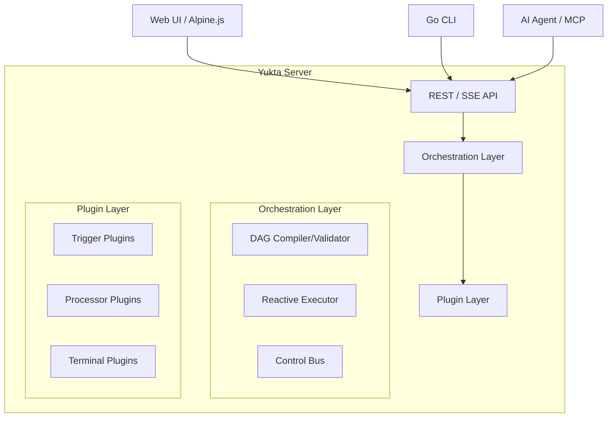

# Architecture Overview

Yukta follows a clean, 3-layer architecture designed for modularity, testability, and high-performance reactive execution.

## 1. High-Level Architecture

## 2. The Three Layers

### Transport Layer (`web`, `mcp`, `ui`)
Handles all external communication.
- **REST API**: Provides endpoints for session configuration, workflow triggering, and log retrieval.
- **MCP (Model Context Protocol)**: Exposes Yukta tools to AI agents.
- **SSE (Server-Sent Events)**: Streams real-time execution status and logs.
- **Web UI**: A visual dashboard for monitoring and managing workflows.

### Orchestration Layer (`core`)
The brain of Yukta.
- **DAG Compiler**: Validates the workflow JSON, ensures no cycles exist, and prepares the execution plan.
- **Reactive Executor**: Uses Project Reactor to traverse the DAG. It manages message flow between nodes, handles branching logic, and manages retries.
- **Control Bus**: Manages node heartbeats, health checks, and administrative commands.

### Plugin Layer (`plugin-api`, `plugins`)
The extensibility point.
- **Trigger Plugins**: Start workflows (e.g., `API_TRIGGER`, `AUTO_TRIGGER`).
- **Processor Plugins**: Transform or route messages (e.g., `PROCESS_EXECUTOR`, `BRANCH`, `MAPPER`).
- **Terminal Plugins**: Endpoints for messages (e.g., `CONSOLE_TERMINAL`).

## 3. Data Flow

1. **Initiation**: A trigger (like a REST call) sends a message into a workflow.
2. **Processing**: The message flows through the DAG. Each node (Plugin) receives a `Message` object, performs its logic, and emits one or more `Message` objects to the next node(s).
3. **Reactive Streams**: The entire flow is modeled as a Reactor `Flux`. This allows for backpressure, easy error handling, and non-blocking execution.
4. **Completion**: The flow ends when a message reaches a terminal node or when there are no more nodes to process.

## 4. Threading Model

- **Event Loop (Reactor)**: All orchestration logic runs on a small number of event loop threads.
- **Virtual Threads (Loom)**: I/O-bound or blocking plugin operations are dispatched to virtual threads.
- **Thread Safety**: The system is designed to be thread-safe by favoring immutability (especially for `Message` objects) and using reactive patterns.

## 5. Domain Models

- **Session**: A logical grouping of workflows and configurations.
- **Workflow**: A Directed Acyclic Graph (DAG) of nodes.
- **Node**: An instance of a plugin within a workflow.
- **Message**: The unit of data passed between nodes, containing a payload and technical headers (traceId, timestamp, etc.).
- **Execution**: A single run of a workflow.
