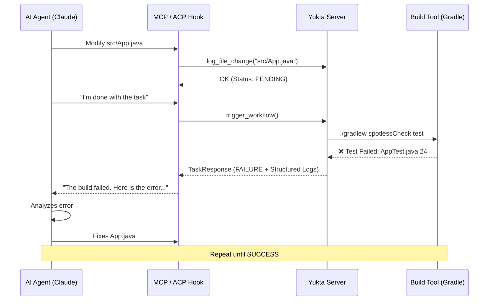

# AI Agent Integrations: MCP & ACP

Yukta is built from the ground up to be the bridge between AI development agents and your local quality gates. It supports two primary protocols for this purpose: **Model Context Protocol (MCP)** and **Agent Client Protocol (ACP)**.

---

## 🤖 Model Context Protocol (MCP)

MCP is an open standard that enables AI models (like Claude) to securely interact with local tools and data. Yukta acts as a native MCP server.

### Why use MCP with Yukta?
- **Zero Configuration**: AI agents that support MCP can "discover" Yukta's capabilities automatically.
- **Direct Tool Access**: The AI can trigger quality checks, read logs, and check file statuses directly as if they were built-in functions.
- **Contextual Awareness**: Yukta provides structured feedback that helps LLMs understand exactly why a build failed.

### Configuring Claude Desktop
To add Yukta to your Claude Desktop instance, add the following to your `claude_desktop_config.json`:

```json
{
  "mcpServers": {
    "yukta": {
      "command": "java",
      "args": ["-jar", "/path/to/yukta-boot.jar"]
    }
  }
}
```

### Available MCP Tools
- `configure_session`: Initialize Yukta for a specific project path and set of tasks.
- `log_file_change`: Notify Yukta that a file has been modified.
- `trigger_workflow`: Run the quality gates and get structured feedback.
- `get_session_status`: Check the current state of a session.

---

## 🛠️ Agent Client Protocol (ACP) & Lifecycle Hooks

ACP focuses on the lifecycle of a task being performed by an agent. Yukta uses this to provide "autonomous vigilance" during the agent's work.

### Lifecycle Integration
Yukta can be integrated into tools like **Claude Code** using lifecycle hooks (pre-commit, post-tool-use).

| Lifecycle Phase | Action in Yukta |
| :--- | :--- |
| **On Start** | Initialize a Yukta session (`POST /api/config`). |
| **During Work** | Every time the agent writes a file, log the path (`POST /api/files`). |
| **On Finish** | Trigger the workflow (`POST /api/workflow/trigger`). |

### Benefits of ACP Integration
- **Guardrails**: Prevents the agent from "submitting" work that doesn't pass tests or style checks.
- **Auto-Correction**: If Yukta returns a failure, the agent receives the error logs and can immediately attempt to fix the issue before the user even sees it.

---

## 🔄 Flow of Integration



---

## 📚 Reference Implementation

For examples of how to implement these hooks in Python or Shell, see the `client/scripts` directory in the repository.
